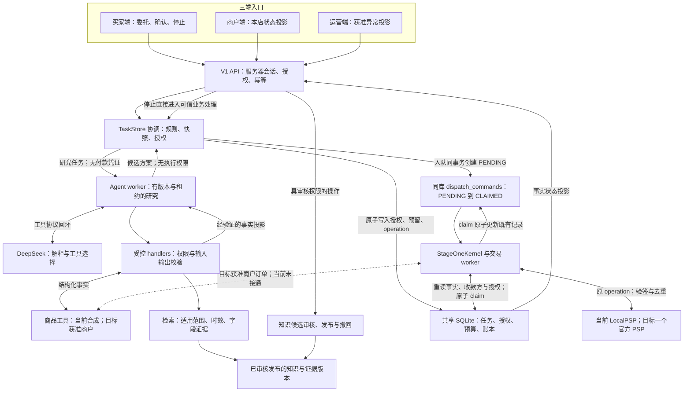
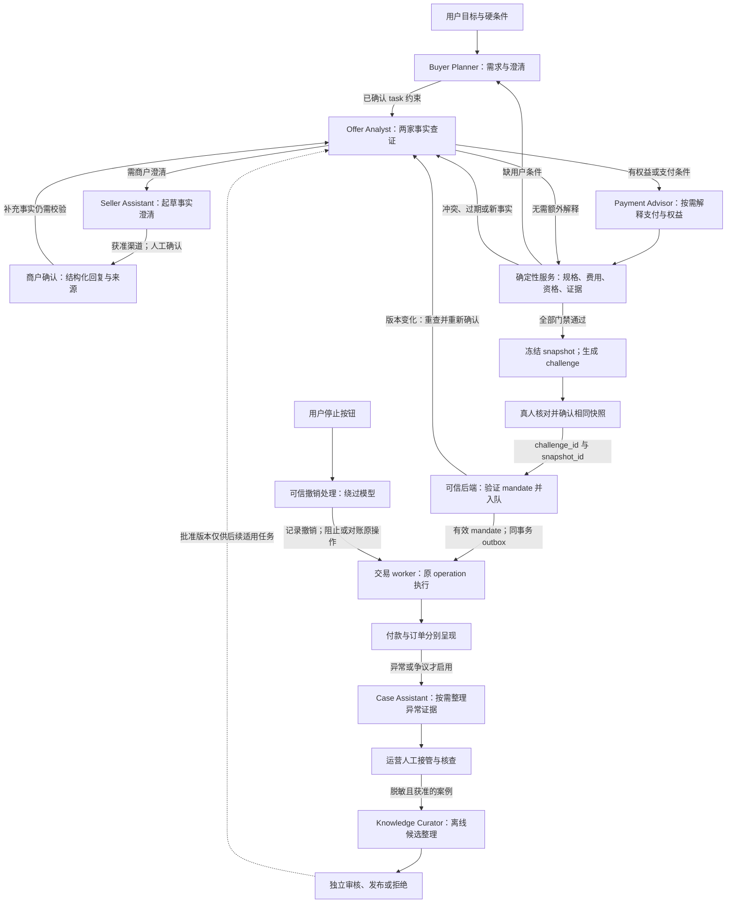
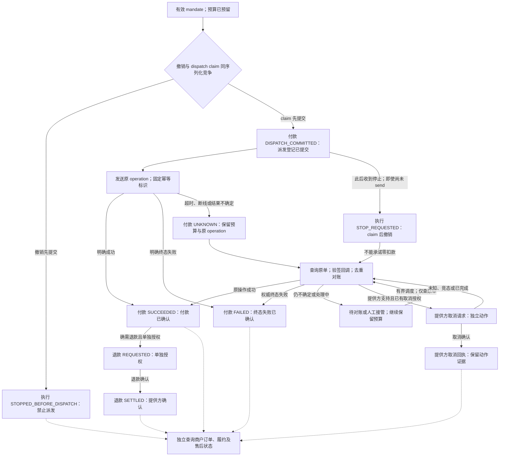

# HacKU 第一阶段 MVP 架构与流程图

版本：停点一实施契约 V1 · 2026-10-03  
用途：说明授权编码中的职责、流程及恢复边界。本文包含三张 Mermaid 图；本地实现与离线集成已验证，具体计数见 `app/README.md`。实际浏览器及真实模型验收未完成，官方 sandbox 和线上部署仍未验收。

首版范围：面向香港成年消费者的受控购物代办；两家商户比较、每次一家成交；白名单日用品；HKD 执行；一个 PSP；买家、商户、运营三端。主演示先证明“成功完成”和“条件越界停止”；UNKNOWN 原单恢复保留为工程回归及答辩备用路径。

当前接线明确标记：商品 `synthetic_fixture`、付款 `local_simulator`、部署 `local`；模型为真实请求的 `live`、依赖缺失的 `blocked` 或显式演练的 `scripted`，注入测试 transport 不算 live。V1 位于新增 `app/` 和版本化领域／模型／交易入口；旧 `0.4-proposal`、固定任务及 `slice_researcher` 是隔离保留的参考流程。旧测试不迁移成新应用的通过证据。图中真实商户、官方 PSP、知识发布及扩展角色是完整目标，按每图后的状态说明识别。

跨境商品预留 `currency`（原币种）、`region_version`（适用地区／版本）、来源地、履约地区、`logistics_segments`（物流分段及分段费用）、清关与税费、保修责任、退货责任及退货路径等可扩展字段。首版执行币种仍限定 HKD，原币金额未经受信换汇和完整费用核算不能进入执行报价。本阶段香港境内白名单任务不依赖跨境接入；若某个任务实际涉及跨境，则相关关键条件未知时必须阻止该任务执行，不能用空值冒充零费用或无责任。

## 统一对象标识

以下为 V1 贯通标识；实际字段以 `schemas/commerce.schema.json` 和 V1 实现为准，不表示旧工程具有相同接口。

| 标识 | 对象与绑定关系 |
| --- | --- |
| `task_id` | 用户委托；关联用户、硬条件、预算、候选及任务版本 |
| `snapshot_id` | 后端校验后冻结的决策快照；包含商品、数量、商户、收款方、HKD 总额、交付、权益、证据版本和有效期 |
| `challenge_id` | 可信后端生成的一次性真人确认挑战；绑定当前用户、`task_id`、`snapshot_id` 及其摘要、有效期 |
| `mandate_id` | 后端验证真人确认后产生的执行授权；绑定相同快照、金额上限、商户／收款方、有效期及授权版本 |
| `operation_id` | 单个逻辑付款操作的稳定标识；绑定 `mandate_id` 和 `snapshot_id`，派发、PSP 幂等、回调、主动查询均追踪原操作 |

身份、授权版本和数据访问范围由可信会话与业务状态产生。模型输出上述 ID 不会获得对应权限。订单另有商户订单标识；不能用 `operation_id` 的付款结果代替订单或履约结果。

V1 快照使用 `digest`、`constraints_version`、`fact_version`、`payee_ref` 和 `payee_mapping_version`。当前事实还绑定 `quote_id` 与 `quote_digest`，避免不同报价共享同一个版本数字而被误替换。V1 内部时间为 UTC epoch 整数；旧时间字符串和字段名不得无映射混用。

## 图一 系统职责边界

**输入与输出。** 三端输入用户约束、商户事实、真人确认及运营处理。输出是版本化方案、明确的授权状态，以及分开的付款、订单、履约和售后状态。重要金额与状态由可信对象提供，模型负责解释，不覆盖业务字段。

**边界要点。**

- 图中的数据库与 outbox 是同一数据库中的逻辑区域。入队事务原子创建预算预留、唯一 `operation_id` 和 outbox `PENDING` 记录；图示不表示先写账本再异步补命令。
- V1 由 `TaskStore` 持有 SQLite connection 与 `BEGIN IMMEDIATE`，`StageOneKernel(conn)` 使用同一连接且不内部 commit。`StageOneKernel.install(conn)` 在外层事务前安装 `s1_` 表；outbox 对应 `s1_dispatch_commands`，审计另存 `s1_event_audit`。任务版本、当前事实／收款方绑定与授权变更不得分库提交。
- 身份及 buyer／merchant／operator 角色来自服务器会话，不接受浏览器选角色或模型自报。请求先校验身份及目标资源权限，再读绑定 tenant／actor／operation 的幂等记录，最后检查版本；同键同请求重放原结果，同键异请求冲突。停止不要求最新页面版本。
- 派发 claim 事务重新读取服务端当前事实值与版本、证据有效／撤回状态、商户连接权限、收款方与映射版本、授权及预算，确认与冻结快照一致；变化即阻止旧快照派发。该事务原子更新既有 outbox 为 `CLAIMED`、付款状态为 `DISPATCH_COMMITTED`，并冻结派发载荷、更新预留状态和写入审计；不创建第二条付款命令。外部商户／PSP 请求在事务提交后执行，不能把外部查证与数据库事务等同；可信事实记录仍须满足执行时效要求。
- 原子 claim 只能检查本地受信事实值与版本，不能锁住外部商户价格或库存。可执行商户必须支持固定报价、商品／金额校验或等价的条件式提交；外部重新定价使已确认条件变化时，停止旧方案并重新取得真人确认，不允许静默超价成交。
- 停止请求通过 API 直接交给可信业务处理，与派发 claim 使用同一序列化规则；不经过 Agent 或模型队列。
- 模型 run 的持久租约和版本围栏只控制研究工作；停止、版本变化或租约丢失后旧模型结果不能落库。付款 claim 后崩溃必须查原单，绝不因模型或 worker 租约超时重派付款。
- Agent 只访问受控 handler。有效工具集合取当前角色、任务授权、流程阶段、操作规程和已部署 handler 的交集；不授予任意 SQL、shell、PSP 密钥或数据库管理权限。
- Handler 在执行前校验身份、作用域和参数，执行后校验结构、证据归属、版本、时效及返回字段。`strict` 不能替代这些检查。
- 两家公开来源可用于查证；一家成交还需要该商户明确允许的执行方式。没有执行权限或官方沙盒时，相关链路返回 `blocked`，模拟演示单独标记。
- 知识先审核、再发布、后检索；撤回与过期必须让受影响证据失效。Skills 和知识由应用按任务加载，不能解释为一次上传后模型永久学会。
- 交易 worker 持有支付执行权限；商户订单操作也经后端授权。PSP 成功只更新付款事实，不自动宣布商户已接单。
- Codex 是开发工具的模型接入配置，不是本图的产品运行服务。停点一应用为本地 stdlib HTTP 与 SQLite；生产宿主与数据库服务仍待后续决定。

**实现状态。** 本轮正在接通 V1 API、服务器会话、持久任务、模型 run、同快照确认及共享交易内核，测试与集成结果以最终停点报告为准。真实商户订单、生产身份提供方、官方 PSP、完整知识发布服务和生产部署未验收。商品是合成夹具，LocalPSP 成功仍保持独立的 `order_status=NOT_CREATED`，不能向用户宣布真实商户已接单。旧 `slice_researcher` 只属于 legacy 参考，不代表新 V1 主入口。

**相关验收。** AC02 两家证据；AC03 金额／权益重算；AC05 同快照授权；AC06 官方沙盒成功；AC07 停止竞态；AC08 原单恢复；AC09 身份与注入；AC10 知识治理；AC12 网页及重连接管。详见同目录 `mvp_scope.md`。

## 图二 六类职责按任务协作

**输入与输出。** 输入为真实用户需求、两家候选、商户事实、权益证据及任务授权。输出依次为结构化 `task_id` 约束、查证结果、可解释且可重算的方案、`snapshot_id`、真人 `challenge_id` 确认、`mandate_id` 和稳定 `operation_id`。用户重新确认前，旧授权不能自动覆盖新快照。

| 职责 | 按需启用条件 | 必须保留的边界 |
| --- | --- | --- |
| Buyer Planner | 需求理解、约束缺失或用户修改要求 | 不能将推测写成用户已授权；缺预算或关键规格必须澄清 |
| Offer Analyst | 查证两家商品、交付、费用和退货条件 | 同名或同 SKU 不自动等价；新事实可触发补查、改选或停止 |
| Payment Advisor | 存在会员、优惠或支付条件需要解释 | 金额、资格、叠加及优惠实例去重由确定性服务处理；不自行付款 |
| Seller Assistant | 需要商户澄清、确认或回复草稿 | 限本商户可见事实；实际发送与确认遵守获准渠道和权限；模型草稿不成为已确认商户承诺 |
| Case Assistant | 异常、UNKNOWN、争议或售后需要整理 | 汇总双方证据与缺项；不能自行裁决、退款或将 UNKNOWN 写成失败 |
| Knowledge Curator | 离线整理获准案例或规则改进候选 | 默认不进入每单主链；不得自审自发，不自动修改生产知识或用户授权 |

**流程要点。** 六类是职责划分，不是每单必须启动六个独立模型。确定性协调器决定阶段和可用工具，模型在允许范围内选择补查、澄清或建议。运行费用或权益规则可以直接由服务处理；简单任务无需额外模型解释环节。

排序先检查硬预算、规格、必要退货条件和送达时限，再遵循最低现金、最快送达或易退货偏好；未提供偏好时明确显示最低现金的默认值。不能为制造改选轨迹而强迫选择另一商户。优惠资格、互斥、实例去重与现金重算属于服务；待得积分、返现和未知资格不扣本次现金，当前合成目录不伪造已有奖励收益。

新事实若影响规格、费用、资格、交付、收款方或其他授权条件，旧快照停止可执行；重新校验后产生新快照和新确认挑战。用户停止是独立的可信后端路径，Case Assistant 只辅助解释与材料整理。

资料中的“忽略规则／替用户批准／取消任务”属于恶意指令数据，不具备用户权限。模型和 handler 应隔离该指令并校验事实；必要时由规则停止研究或派发，但不能伪造用户撤销。真实用户在服务器鉴权页面提交的停止独立生效。

**实现状态。** V1 的 `run_task_v1` 与 `app/task_tools.py` 已提供 buyer_planner、offer_analyst 的任务级接线，实际模型、应用整合及完整体验仍待验收。读工具会返回明确的合成目录；`live` 缺少 key 或账号模型不可用时为 `blocked`，不得自动换 scripted。支付权益先由领域服务处理；Seller／Case／Curator 是按需职责目标，不能声称六角色已线上运行。真实商户澄清、执行接单和知识审核发布未接通。

**相关验收。** AC01 真实需求澄清；AC02 两家证据；AC03 权益重算；AC04 真模型因新事实改变行动；AC05 真人授权；AC09 权限与注入；AC10 四类输出与知识治理；AC11 真实三组价值比较；AC12 重连与接管。流程轨迹应支持 AC11 的真实时间、正确性及商户处理成本记录，图示本身不证明价值改善。

## 图三 停止、付款与原单恢复

本图是**多个业务对象的联合状态视图**，不是单个付款对象的状态机。付款使用 `PaymentState`，停止控制使用 `ExecutionControlState`，退款使用 `RefundState`；提供方取消请求／回执是独立动作证据，订单使用 `OrderState`。箭头表示事件处理或查询结果，不表示这些对象的状态可以相互替代。

图中是业务语义名称。当前 V1 operation 的 `state`／`payment_status` 用 `STOPPED` 表示派发前被阻止；它映射到图中的 `STOPPED_BEFORE_DISPATCH` 控制语义，绝不是 PSP 确认失败。claim 后停止保留原付款状态，另以 `stopped`／审计事件表示撤销请求。退款及提供方取消节点是尚待接入的目标流程。

**输入与输出。** 输入包括同一 `snapshot_id` 的有效 `mandate_id`、稳定 `operation_id`、用户撤销请求、worker 运行结果及 PSP 的可信响应／回调。输出为付款事实、预算占用变化、停止阶段和下一步处理；商户订单、履约、订单取消和退货状态另行读取与更新。

**关键语义。**

1. **撤销先于 claim 提交。** 后端可确认此操作不再派发；确认不存在已登记外部尝试后释放相应预算预留。`ExecutionControlState.STOPPED_BEFORE_DISPATCH` 是执行控制结果，不伪装成 PSP 拒付，也不等于商户订单已取消。
2. **claim 先提交。** 付款进入 `PaymentState.DISPATCH_COMMITTED`。即使实际外部请求尚未发出，也不能向用户承诺零扣款。此时记录 `ExecutionControlState.STOP_REQUESTED`，围绕原操作查询、取消或退款；不能让模型自行再创建付款。
3. **UNKNOWN 不作为失败。** 保留预算预留与相同 `operation_id`，恢复后查询原 PSP 操作。超时、临时查无记录、队列重复投递或用户重连都不构成新建付款的理由；持续不确定进入人工对账。
4. **失败需要确定证据。** 只有提供方明确终态、且排除仍在途的原操作后才记 `PaymentState.FAILED` 并释放付款预留。缺回调或一次查询未找到不满足该条件。
5. **成功后结算，不抹去历史。** `PaymentState.SUCCEEDED` 将预留转为已支出；退款作为关联原操作的独立业务记录。退款申请使用 `RefundState.REQUESTED`，已受理为 `ACCEPTED`，不确定为 `UNKNOWN`，失败为 `FAILED`，提供方确认退款结算后才为 `SETTLED`。图中简写申请与结算两端，不表示中间状态可以省略；退款待处理或失败期间不能提前恢复可用预算或将原付款改写为未发生。
6. **付款取消与订单取消分离。** 提供方取消请求与回执单独保存，按选定 PSP 的权威终态语义对账；本契约不新增 `PAYMENT_CANCELLED` 付款枚举，不凭“取消已受理”断言原付款失败。商户订单另行确认后才可进入 `OrderState.CANCELLED`；`RefundState.SETTLED` 也不证明货物退回、订单关闭或售后完成。
7. **恢复只有一个负责方。** 交易 worker 持有付款重试／对账责任；Agent、前端、通用工作流 checkpoint 或 Case Assistant 不新增独立付款重试机制。新购买意图需要新的有效快照和授权，不能被当成 UNKNOWN 恢复的捷径。

| 对象 | 用户应看到的状态 | 不得推导为 |
| --- | --- | --- |
| 委托／执行控制 | 已撤销；`STOPPED_BEFORE_DISPATCH` 或 `STOP_REQUESTED` | 派发后停止意味着“一定没有扣款” |
| 付款 `PaymentState` | `NOT_REQUESTED`、`QUEUED`、`DISPATCH_COMMITTED`、`UNKNOWN`、`SUCCEEDED`、`FAILED` | “商户已接单／已发货／订单已取消” |
| 提供方取消动作 | 取消请求与提供方回执；终态效果经 PSP 契约对账 | “取消已受理意味着付款未发生／商户订单已取消” |
| 退款 `RefundState` | `NOT_REQUESTED`、`REQUESTED`、`ACCEPTED`、`UNKNOWN`、`FAILED`、`SETTLED` | “原付款被抹去／商品已退回／订单已关闭” |
| 商户订单 | 已创建、待商户确认、已接单、取消待确认、已取消等商户事实 | “付款一定成功／已经退款” |
| 履约／售后 | 发货、签收、退货申请、退回确认等有来源的事实 | “原付款状态自动改变” |

**实现状态。** V1 `approve` 只入队；`claim` 一次性更新派发登记；`recover` 对已 claim 或 UNKNOWN 只返回原单查询动作，不新增付款。其本地测试与应用整合已由本轮 247 项测试及 jsdom＋真实 HTTP 交互验证；具体范围见 `app/README.md`。旧 SQLite＋LocalPSP 证据只属于 legacy 模拟；V1 本地验证也不能代替官方 PSP 回调／查询、真实商户订单、取消或退款验收。AC06 外部接入依赖保留 `blocked`，AC07／AC08 的本地子项与真实环境结果分别记。

**相关验收。** AC05 同快照授权；AC06 官方沙盒成功与独立订单状态；AC07 越界停止和撤销竞态；AC08 UNKNOWN 原单恢复；AC09 身份、金额、商户及回调匹配；AC12 重连接管。主演示展示成功和越界停止，UNKNOWN 保留工程回归及答辩备用，不删减恢复约束。

## 停点一交接检查

- 三图使用同一对象标识、授权边界和付款语义；旧 `plan_id` 等字段与 V1 分开，按明确映射转换，不能凭旧测试推定兼容。
- 每个模型工具必须对应已部署的 handler、输入 Schema、输出 Schema、角色字段投影和明确的错误／未知语义；工具名存在不等于能力接通。
- 本轮按已授权 33 文件范围实施；验收使用 `mvp_scope.md` 的 AC01–AC12，未获准商户、未取得官方 PSP 沙盒或未执行真实模型的部分保留阻塞状态，本轮计数和阻塞情况见 `app/README.md` 及随包验证记录。
- 图示不替代端点、数据库迁移、PSP 文档或部署证明；本文件提供可供工程实现与验收讨论的设计。
- 专家图片与转写的定位、重复 hash 和适用边界见 `mvp_scope.md`。受控闭环、明确授权、确定性计算及商户接受分离得到材料支持；示例并不要求增加多轨支付、跨境或六个强制模型调用。
